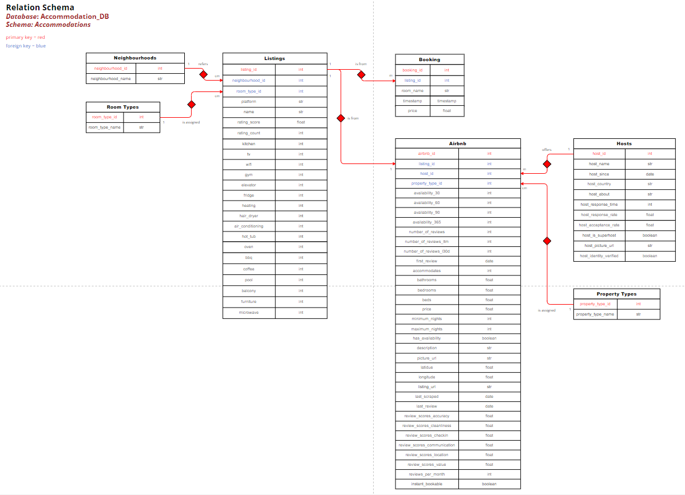

# Accommodation Analysis Vienna

## Concept
The topic of this project is the analysis of data on listed accommodations from Airbnb and Booking.com in Vienna.
It includes a large dataset from Airbnb and continuous data from Booking.com.

**Airbnb:**
The data is collected from [Inside Airbnb](https://insideairbnb.com/get-the-data/). This site provides .csv files for each quarter within the last year.
The files are combined and transformed so they can be loaded into the database in a normalized form. 
The transformed .csv files are saved as backups.

**Booking.com:**
The data is scraped directly from [Booking.com](https://www.booking.com/index.de.html?label=gen173nr-1BCAEoggI46AdIM1gEaA6IAQGYAQe4ARfIAQzYAQHoAQGIAgGoAgO4Asqd_LIGwAIB0gIkOGViYjdlOGEtODNmZi00MzVhLWE2NmQtMmFjNGIyMTcxNjA42AIF4AIB&sid=d8ad732f4e6b269920b296712747472b&keep_landing=1&sb_price_type=total&) using Selenium. The search is limited
to accommodations in Vienna available from June 27-28, 2024, for 2 people. First, the links to the
accommodations are scraped, which are then opened to directly save the information from the listings.
The data is transformed and stored in a normalized form in the database.

**Google Cloud:**
To enable a continuous data stream for the Booking.com data, a PostgreSQL database is hosted in the cloud.
The relevant scripts are stored in a Virtual Machine and started every 8 hours via a Cron job.
The data is saved in .csv files in cloud storage as a backup.

**Machine Learning:**
A data mart is generated from the main database to aggregate all relevant data for a machine learning model.
This data undergoes further processing to ensure compatibility with the model. Both XGBoost and a neural network
model are used. The final models are used to predict accommodation prices based on various features.
The model can be tested via user input with a Tkinter interface.

**Visualizations:**
An interactive Power BI dashboard is also created to provide insights into different accommodations,
illustrate price trends and compare the platforms.

### Relation Schema

## Project Structure
The project structure includes the following modules stored in the "modules" folder:

**database.ini** 
Contains parameters for connecting to a PostgreSQL database. 
IMPORTANT: Fill out database.ini with your data before running the code!

**config.py** 
Provides a function to create a dictionary with the parameters from database.ini. 
This dictionary is used in the database.py module to establish a connection to your database management system.

**database.py** 
Defines a class for creating, populating and managing a PostgreSQL database.

**clean_data.py** 
Defines functions for transforming data in a Pandas DataFrame.

**airbnb_dataset_link_scraper.py** 
Contains a function to scrape the current links from Inside Airbnb.

**airbnb_price_scraper.py** 
Contains a function to scrape the current prices of specific Airbnb listings.
Was used to correct some data of the original .csv files and already saved airbnb_prices.csv
and airbnb_prices_off.csv in main folder to replace price of specific listings.

**booking_link_scraper.py** 
Contains a function to scrape hotel links from Booking.com search results for a specified
location and date range.

**booking_hotel_information_scraper.py** 
Scrapes hotel information from Booking.com for a specified location and date range.

**general_functions.py** 
Contains general utility functions used by the Booking.com scraper.

### Following files can be executed in given order to recreate the project:

#### If you choose to execute every single file (not recommended):
1. transform_airbnb_data.py 
2. create_main_database.py 
3. flow_booking_data.py - **usually only executed in Google Cloud** 
4. create_data_mart.py - **download .csv of data mart after creating (already given: machine_learning_data.csv)** 

#### If you choose to execute step 1-4 at once, you can also run main.py
5. transform_machine_learning_data.py 

#### If you choose Neural Network:
6. machine_learning_nn.py 
7. prediction_nn.py 

#### If you choose XGBoost:
6. model_xgb.py 
7. training_xgb.py 
8. prediction_xgb.py 

### Following files provide scripts referring to the cloud (for testing only):

**files in folder 'cloud':** 
- get_data_from_cloud.py - downloads data from Cloud storage 
- service-account-key.json - The service account is used for Google Cloud services and is assigned various roles
to access the Google Cloud database and our storage bucket through the virtual machine in our project. 
- test_postgres.py - test if connection to Cloud database is working

